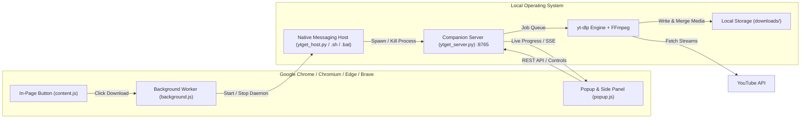

# ytget — High-Speed YouTube Downloader Chrome Extension & Companion Server

[](https://www.python.org/downloads/)
[](#prerequisites)
[](test_ytget_server.py)
[](extension/manifest.json)
[](LICENSE)
[](https://github.com/yt-dlp/yt-dlp)

**ytget** is a modern, full-featured browser-integrated YouTube downloader. It pairs a **Manifest V3 Chrome Extension** (with both an interactive Popup and Chrome Side Panel) with a lightweight, multi-threaded **Python companion server** powered by `yt-dlp` and `FFmpeg`.

Download single videos, full playlists, or extract high-fidelity MP3 audio directly from YouTube with live speed and progress metrics, concurrent multi-job queues, and zero browser overhead.

---

## Table of Contents

- [System Architecture](#system-architecture)
- [Key Features](#key-features)
- [Prerequisites](#prerequisites)
- [Installation Guide](#installation-guide)
  - [Windows (PowerShell / Command Prompt)](#option-a-windows-installation)
  - [Linux & macOS (Terminal)](#option-b-linux--macos-installation)
- [Chrome Extension Setup](#chrome-extension-setup)
- [Managing the Companion Server](#managing-the-companion-server)
- [User Guide](#user-guide)
- [Settings & Customization](#settings--customization)
- [Repository File Guide (For GitHub Upload)](#repository-file-guide-for-github-upload)
- [REST API Reference](#rest-api-reference)
- [Troubleshooting & FAQ](#troubleshooting--faq)
- [Automated Testing](#automated-testing)
- [License](#license)

---

## System Architecture



1. **Extension Client**: Interacts with YouTube pages, rendering adaptive download buttons and providing a persistent side panel/popup to queue and monitor downloads.
2. **Native Messaging Bridge**: Allows the Chrome extension to automatically launch or terminate the local Python background service with one click (no manual terminal commands required).
3. **Companion Server**: Runs a threaded HTTP server on `127.0.0.1:8765` handling async download requests, queue management, cancellation signals, deduplication, and file serving.
4. **Download Engine**: Leverages `yt-dlp` with automatic JS runtime challenge resolution (Node.js/Deno/Bun) and FFmpeg for high-speed multiplexing and tag embedding.

---

## Key Features

### ⚡ Concurrent Multi-Downloads
- Queue multiple videos or full playlists simultaneously.
- Configurable **Max Concurrent Downloads** (default: **10**, adjustable from 1 to 50 in Settings).
- Downloads exceeding the concurrency limit wait in queue and automatically start as active slots free up.

### 📊 Individual Live Progress Cards
- Simultaneous real-time progress cards for every active download.
- Live percentage, download speed (e.g., `12.4 MB/s`), dynamic ETA, and pulse animations.
- Separate tabs for **Active** and **Completed** downloads.

### 🛑 Instant 0ms Cancellation & Pause/Resume
- **Immediate Cancel**: Dismisses the active card instantly, cleanly aborts network connections and FFmpeg subprocesses, and releases the slot.
- **Pause & Resume**: Pause active downloads without losing downloaded fragments; resume anytime.

### 🎯 Adaptive In-Page YouTube Integration
- Automatically injects a native-styled **⬇ ytget** button into YouTube video action bars and playlist headers.
- Built-in dropdown selector for quality (`Best`, `1080p`, `720p`, `480p`, `360p`, `Audio MP3`).
- Fully adapts to YouTube Single Page Application (SPA) navigation without page reloads.

### 🪟 Dual Interface: Popup or Chrome Side Panel
- Switch freely between the standard toolbar dropdown popup and the persistent **Chrome Side Panel** via Settings.
- Responsive, modern dark-themed glassmorphism interface.

### 🎵 High-Fidelity Audio & Rich Metadata
- Download audio tracks as 320kbps MP3s with automatic metadata tagging (Title, Artist, Album, Release Date, Track Numbers).
- Embeds high-resolution cover artwork into MP3 and MP4 containers.

### 🎚 Dynamic Format & File Size Detection
- **Exact File Sizes (MB/GB)**: Live calculation of download sizes for every available video resolution and MP3 audio track.
- **Smart Adaptive Filtering**: Inspects YouTube to discover only the resolutions that actually exist for the video. If an older video only supports 360p or 240p, unavailable higher resolutions (1080p, 720p, 480p) are automatically hidden.
- **Full 1080p, 2K & 4K Streams**: Unlocked full-fidelity multi-stream extraction with automatic JS challenge solving to guarantee genuine 1080p, 1440p, and 4K quality.

### 🔍 Smart Skip & Deduplication
- Automatically detects already-downloaded videos or playlist items to prevent redundant downloads and save bandwidth.

---

## Prerequisites

Before starting, install the core dependencies for your operating system:

| Dependency | Purpose | Minimum Version | Installation Command |
| :--- | :--- | :--- | :--- |
| **Python** | Companion backend & native host | `3.10+` | Windows: `winget install Python.Python.3.12`<br>macOS: `brew install python`<br>Linux: `sudo apt install python3 python3-venv` |
| **FFmpeg** | Merging audio/video & MP3 encoding | `4.0+` | Windows: `winget install Gyan.FFmpeg`<br>macOS: `brew install ffmpeg`<br>Linux: `sudo apt install ffmpeg` |
| **Node.js** *(Optional)* | YouTube JS token challenge solver | `18.0+` | Windows: `winget install OpenJS.NodeJS`<br>macOS: `brew install node`<br>Linux: `sudo apt install nodejs` |

> [!TIP]
> Having **Node.js**, **Deno**, or **Bun** installed prevents YouTube HTTP 403 Forbidden errors by allowing `yt-dlp` to execute YouTube's player challenge scripts.

---

## Installation Guide

### Option A: Windows Installation

Open **PowerShell** or **Command Prompt** (cmd) and follow these steps:

```cmd
# 1. Clone your repository
https://github.com/eyasuasegid/ytget-chrome-extention.git
cd yt-playlist-dl

# 2. Create and activate a Python virtual environment
python -m venv venv
venv\Scripts\activate

# 3. Install Python dependencies
pip install -r requirements.txt

# 4. Register the Chrome Native Messaging host
python install_native_host.py
```

> [!NOTE]
> On Windows, `install_native_host.py` creates `com.ytget.server.json` and automatically registers the host in the Windows Registry under `HKCU\Software\Google\Chrome\NativeMessagingHosts\com.ytget.server` (as well as Microsoft Edge and Brave).

---

### Option B: Linux & macOS Installation

Open your terminal and run:

```bash
# 1. Clone your repository
https://github.com/eyasuasegid/ytget-chrome-extention.git
cd yt-playlist-dl

# 2. Create and activate a Python virtual environment
python3 -m venv venv
source venv/bin/activate

# 3. Install Python dependencies
pip install -r requirements.txt

# 4. Make shell scripts executable & register the Native Messaging host
chmod +x ytget_host.sh ytget_host.py
python3 install_native_host.py
```

> [!NOTE]
> On Linux and macOS, `install_native_host.py` places the manifest into `~/.config/google-chrome/NativeMessagingHosts/` (or `~/Library/Application Support/Google/Chrome/NativeMessagingHosts/` on macOS).

---

## Chrome Extension Setup

Once the host is registered, install the extension in your browser:

1. Open Google Chrome (or Brave, Edge, Chromium).
2. Navigate to `chrome://extensions/`.
3. Enable **Developer mode** using the toggle switch in the top-right corner.
4. Click the **Load unpacked** button.
5. Select the **`extension/`** folder inside the `yt-playlist-dl` directory.
6. Click the Extensions (puzzle piece) icon in your Chrome toolbar and **pin** **ytget**.

> [!IMPORTANT]
> The extension includes a consistent `"key"` in `extension/manifest.json`. This guarantees that your extension ID is always `obgihacdohhjonihcibbdfgmnmllogcb` across all machines, matching the native messaging registration.

---

## Managing the Companion Server

You have three convenient ways to start or stop the companion server:

### Method 1: One-Click Inside the Extension (Recommended)
Open the extension popup. If the server is offline, click the green **Start Server** button. The extension will automatically spawn the background server via Native Messaging.

### Method 2: Command-Line Wrapper
You can control the server from your terminal:

**Windows**:
```cmd
ytget_host.bat start     # Starts server in background
ytget_host.bat status    # Checks if server is responding
ytget_host.bat stop      # Terminates server process
```

**Linux / macOS**:
```bash
./ytget_host.sh start    # Starts server in background
./ytget_host.sh status   # Checks if server is responding
./ytget_host.sh stop     # Terminates server process
```

### Method 3: Direct Foreground Execution
For debugging or viewing live logs in your terminal:
```bash
# Windows
python ytget_server.py

# Linux / macOS
venv/bin/python ytget_server.py
```

---

## User Guide

### 1. Downloading from YouTube Directly
When viewing any YouTube video or playlist:
1. Look below the video title or on the playlist banner for the **⬇ ytget** button.
2. Click the dropdown arrow to pick your preferred resolution (`1080p`, `720p`, `Audio MP3`, etc.).
3. Click the button to start downloading immediately in the background.

### 2. Downloading via the Extension Popup / Side Panel
1. Click the **ytget** icon in your browser toolbar.
2. Paste any YouTube video or playlist URL into the input field.
3. Select your quality preference.
4. Click **Download Video** or **Download Playlist**.

### 3. Managing Downloads
- **Active Tab**: Displays real-time progress cards for all ongoing and queued jobs.
- **Completed Tab**: Lists downloaded files with sizes and direct folder access.
- **Controls**:
  - Click **⏸** to pause an active download.
  - Click **▶** to resume a paused download.
  - Click **✕** to immediately cancel and purge the job.

---

## Settings & Customization

Click the **⚙ Settings** button in the extension header to configure:

| Setting | Default | Description |
| :--- | :--- | :--- |
| **Max Concurrent Downloads** | `10` | Number of downloads processed simultaneously (1 to 50). |
| **Display Mode** | `Popup` | Choose between classic **Popup** or persistent **Chrome Side Panel**. |
| **Custom Download Folder** | `downloads/` | Absolute path on disk where media files are saved. |

---

## Repository File Guide (For GitHub Upload)

When creating your GitHub repository, ensure you upload the project files while keeping local virtual environments and downloaded files excluded:

### Files to Commit & Push
```text
yt-playlist-dl/
├── extension/                     # Chrome Extension (Manifest V3)
│   ├── manifest.json              # Extension manifest (with pinned extension key)
│   ├── background.js              # Service worker & native messaging communication
│   ├── content.js                 # In-page YouTube button injector
│   ├── content.css                # Styling for in-page YouTube buttons
│   ├── popup.html                 # Extension popup interface
│   ├── popup.css                  # Modern styling for popup & side panel
│   ├── popup.js                   # Frontend application logic & polling
│   ├── sidepanel.html             # Dedicated side panel layout
│   └── icons/                     # Extension icons (16, 32, 48, 128 px)
│       ├── icon16.png
│       ├── icon32.png
│       ├── icon48.png
│       └── icon128.png
├── ytget_server.py                # Core Python backend daemon & download manager
├── ytget_host.py                  # Chrome Native Messaging stdio host script
├── ytget_host.sh                  # Linux/macOS background launcher script
├── ytget_host.bat                 # Windows background launcher script
├── install_native_host.py         # Cross-platform native messaging host installer
├── test_ytget_server.py           # Comprehensive offline unit test suite (28 tests)
├── create_icons.py                # Script to regenerate PNG icons if needed
├── requirements.txt               # Minimal Python dependencies (yt-dlp)
├── .gitignore                     # Git ignore rules
├── LICENSE                        # MIT Open Source License
└── README.md                      # Complete documentation
```

### Gitignored Folders (Do NOT upload to GitHub)
- `venv/` or `.venv/` (Python virtual environment)
- `downloads/` (Your personal downloaded videos and audio)
- `*.log` (e.g. `ytget_server.log`)
- `*.pid` (Server process ID files)
- `__pycache__/` (Compiled Python bytecode)

---

## REST API Reference

The companion server (`127.0.0.1:8765`) exposes a complete JSON REST API that can be used by the extension or integrated into custom scripts:

| Endpoint | Method | Description | Sample Request / Response |
| :--- | :--- | :--- | :--- |
| `/status` | `GET` | Health check & server status | `{"status": "ok", "service": "ytget", "version": "1.0.0", "active_jobs": 1, "max_concurrent": 10}` |
| `/download` | `POST` | Queue a video or playlist download | Body: `{"url": "https://youtu.be/...", "quality": "1080"}`<br>Response: `{"status": "queued", "id": "018c8458"}` |
| `/tasks` | `GET` | Get live progress of all active & queued downloads | Returns array of job objects with percent, speed, ETA, and state |
| `/pause/{id}` | `POST` | Pause an active download | `{"status": "paused", "id": "018c8458"}` |
| `/resume/{id}` | `POST` | Resume a paused download | `{"status": "resumed", "id": "018c8458"}` |
| `/cancel/{id}` | `POST` | Immediately cancel and abort a download | `{"status": "cancelled", "id": "018c8458"}` |
| `/downloads` | `GET` | List all completed downloads on disk | Returns array with filename, size, path, and modified date |
| `/probe` | `GET`, `POST` | Inspect video formats, available resolutions & file sizes | `GET /probe?url=...`<br>Returns: `{"status": "ok", "available_heights": [1080, 720], "qualities": [...]}` |
| `/settings` | `GET` | Fetch current server settings | `{"download_dir": "/...", "max_concurrent": 10}` |
| `/settings` | `POST` | Update server settings | Body: `{"max_concurrent": 15}` |

---

## Troubleshooting & FAQ

### 1. YouTube Downloads Fail with HTTP 403 Forbidden
- **Cause**: YouTube requires JavaScript challenge solver tokens for certain media streams.
- **Solution**: Install **Node.js** (`winget install OpenJS.NodeJS` on Windows, or `sudo apt install nodejs` on Linux). `yt-dlp` will automatically detect `node` and solve challenge tokens.

### 2. "Server Offline" in Extension Popup
- **Cause**: The background server is not currently running.
- **Solution**: Click the green **Start Server** button in the popup, or run `ytget_host.bat start` (Windows) / `./ytget_host.sh start` (Linux/macOS) in your terminal.

### 3. Native Messaging "Specified native messaging host not found"
- **Cause**: The host manifest has not been registered with your browser.
- **Solution**: Run `python install_native_host.py` in your project folder. On Windows, make sure you ran the script with regular user privileges (it writes to `HKCU`).

### 4. Audio does not convert to MP3 / Videos do not merge
- **Cause**: FFmpeg is not installed or not in your system PATH.
- **Solution**: Install FFmpeg (`winget install Gyan.FFmpeg` on Windows, `brew install ffmpeg` on macOS, or `sudo apt install ffmpeg` on Ubuntu/Debian).

### 5. Port 8765 Already in Use
- **Cause**: Another instance of `ytget_server.py` is running.
- **Solution**: Run `ytget_host.bat stop` (Windows) or `./ytget_host.sh stop` (Linux/macOS) to terminate existing instances, or launch with a custom port:
  ```bash
  python ytget_server.py --port 8766
  ```

---

## Automated Testing

The project includes an exhaustive offline unit test suite in [`test_ytget_server.py`](test_ytget_server.py) with 28 automated tests covering:
- Format resolution and quality selector strings
- Filename sanitization & playlist path padding
- Single video vs playlist URL identification
- Thread-safe download queues and concurrency caps
- Instant cancellation and pause/resume signal propagation
- REST API request handling and CORS headers
- In-place file deduplication and completed detection

Run the test suite:
```bash
# Windows
venv\Scripts\python -m unittest test_ytget_server.py

# Linux / macOS
venv/bin/python -m unittest test_ytget_server.py
```

All 28 tests run completely offline using mocked network streams without hitting YouTube servers.

---

## License

This project is licensed under the **MIT License** — see the [LICENSE](LICENSE) file for details.
Feel free to use, modify, and distribute this software for personal and commercial projects.
